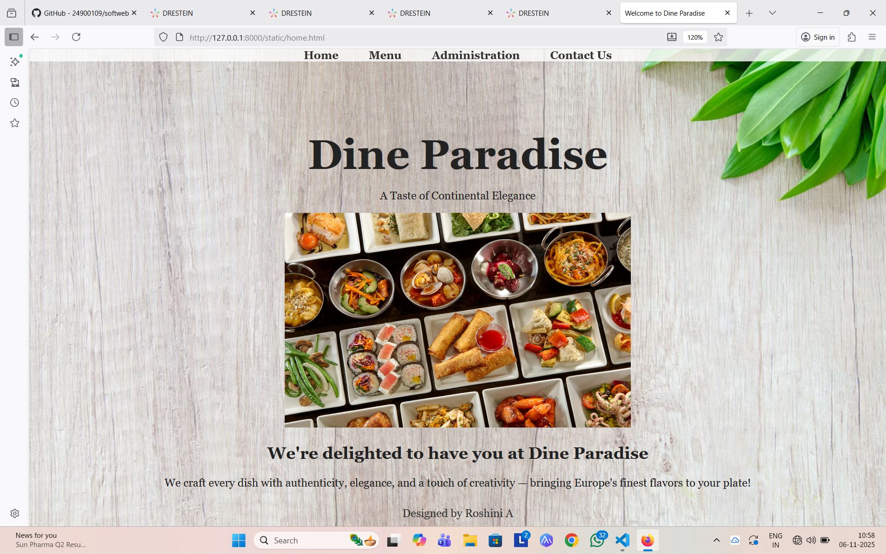
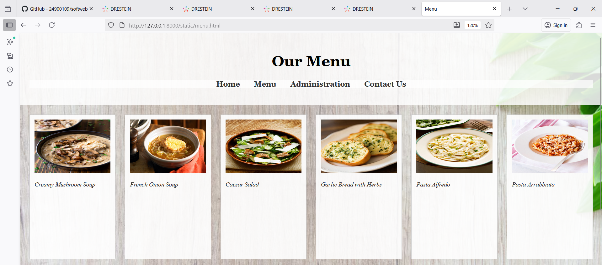
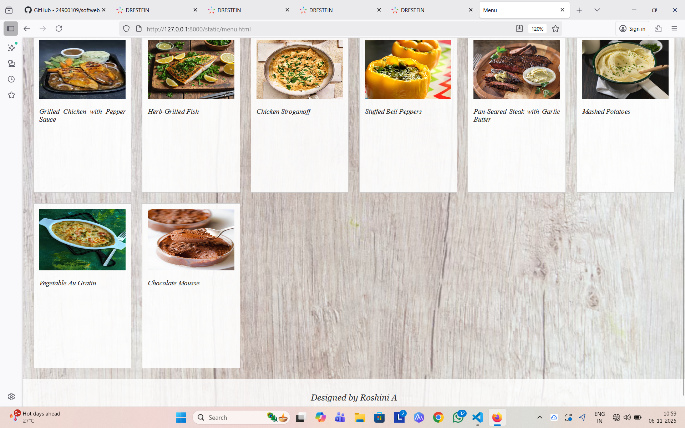
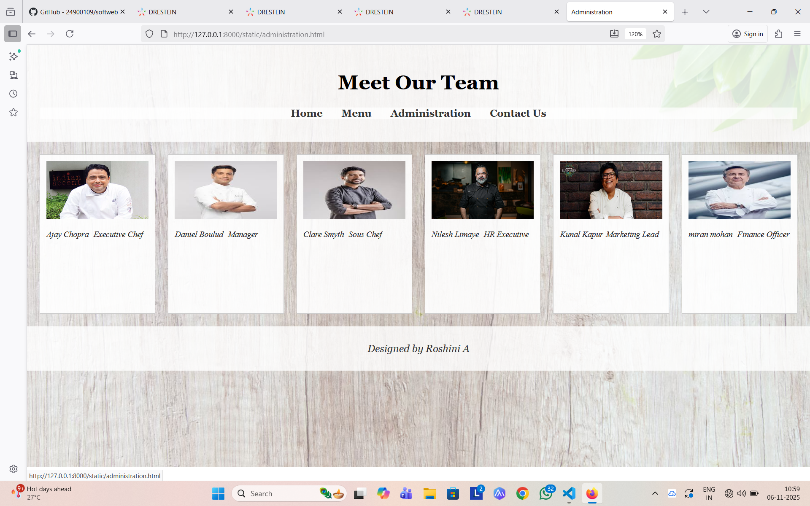
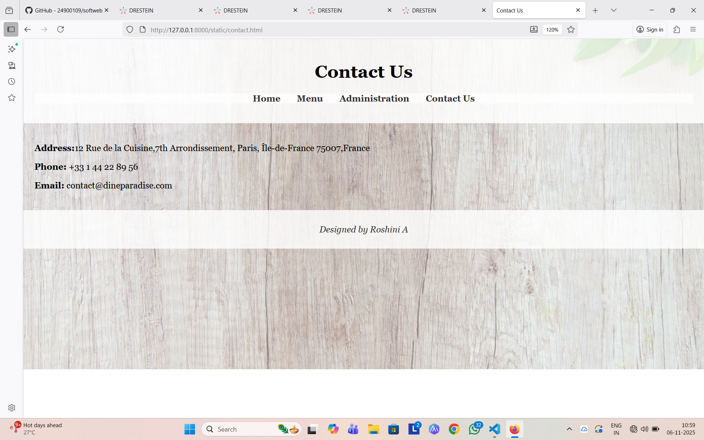

# Ex.07 Restuarant Website
## Date:06/11/2025

## AIM:
To develop a static Resturant website to display the menu and services provided by the resturant.

## DESIGN STEPS:

### Step 1:
Requirement collection.

### Step 2:
Creating the layout using HTML and CSS.

### Step 3:
Updating the sample content.

### Step 4:
Choose the appropriate style and color scheme.

### Step 5:
Validate the layout in various browsers.

### Step 6:
Validate the HTML code.

### Step 7:
Publish the website in the given URL.

## PROGRAM:
home.html
```
<!DOCTYPE html>
<html lang="en">
<head>
  <meta charset="UTF-8">
  <title>Welcome to Dine Paradise</title>
  <style>
    body {
      margin: 0;
      font-family: Georgia, serif;
      background: url('foodbg.avif') no-repeat center/cover;
      color: #222;
      text-align: center;
    }
    header {
      background: rgba(255, 255, 255, 0.8);
      position: fixed;
      top: 0;
      width: 100%;
    }
    nav a {
      text-decoration: none;
      color: #333;
      margin: 0 20px;
      font-weight: bold;
    }
    nav a:hover { color: #b35c00; }
    .banner {
      padding-top: 90px; /* lifted up (was 120px before) */
    }
    .banner h1 {
      font-size: 60px;
      font-weight: 900; /* extra bold */
      margin-bottom: 5px;
    }
    footer { color: #333; padding: 10px; }
  </style>
</head>
<body>
  <header>
    <nav>
      <a href="home.html">Home</a>
      <a href="menu.html">Menu</a>
      <a href="administration.html">Administration</a>
      <a href="contact.html">Contact Us</a>
    </nav>
  </header>

  <div class="banner">
    <h1>Dine Paradise</h1>
    <p>A Taste of Continental Elegance</p>
    
  </div>

  <h2>We're delighted to have you at Dine Paradise</h2>
  <p>We craft every dish with authenticity, elegance, and a touch of creativity — bringing Europe's finest flavors to your plate!</p>

  <footer>Designed by Roshini A</footer>
</body>
</html>
```

menu.html
```
<!DOCTYPE html>
<html lang="en">
<head>
  <meta charset="UTF-8">
  <title>Menu</title>
  <link rel="stylesheet" href="style.css">
  <style>
    body {
      margin: 0;
      font-family: Georgia, serif;
      background: url('foodbg.avif') no-repeat center/cover;
      color: #222;
      text-align: center;
    }
  </style>
</head>
<body>
  <header>
    <h1>Our Menu</h1>
    <nav>
      <ul>
        <li><a href="home.html">Home</a></li>
        <li><a href="menu.html">Menu</a></li>
        <li><a href="administration.html">Administration</a></li>
        <li><a href="contact.html">Contact Us</a></li>
      </ul>
    </nav>
  </header>
  <main>
    <div class="grid">
      <div class="card"><p>Creamy Mushroom Soup</p></div>
      <div class="card"><p>French Onion Soup</p></div>
      <div class="card"><p>Caesar Salad</p></div>
      <div class="card"><p>Garlic Bread with Herbs</p></div>
      <div class="card"><p>Pasta Alfredo</p></div>
      <div class="card"><p>Pasta Arrabbiata</p></div>
      <div class="card"><p>Grilled Chicken with Pepper Sauce</p></div>
      <div class="card"><p>Herb-Grilled Fish</p></div>
      <div class="card"><p>Chicken Stroganoff</p></div>
      <div class="card"><p>Stuffed Bell Peppers</p></div>
      <div class="card"><p>Pan-Seared Steak with Garlic Butter</p></div>
      <div class="card"><p>Mashed Potatoes</p></div>
      <div class="card"><p>Vegetable Au Gratin</p></div>
      <div class="card"><p>Chocolate Mousse</p></div>

    </div>
  </main>
  <footer>
    <p>Designed by Roshini A</p>
  </footer>
</body>
</html>
```

administration.html
```
<!DOCTYPE html>
<html lang="en">
<head>
  <meta charset="UTF-8">
  <title>Administration</title>
  <link rel="stylesheet" href="style.css">
  
</head>
<body>
  <header>
    <h1>Meet Our Team</h1>
    <nav>
      <ul>
        <li><a href="index.html">Home</a></li>
        <li><a href="menu.html">Menu</a></li>
        <li><a href="administration.html">Administration</a></li>
        <li><a href="contact.html">Contact Us</a></li>
      </ul>
    </nav>
  </header>
  <main>
    <div class="grid">
      <div class="card"><p>Ajay Chopra -Executive Chef</p></div>
      <div class="card"><p>Daniel Boulud -Manager</p></div>
      <div class="card"><p>Clare Smyth -Sous Chef</p></div>
      <div class="card"><p>Nilesh Limaye -HR Executive</p></div>
      <div class="card"><p>Kunal Kapur-Marketing Lead</p></div>
      <div class="card"><p>miran mohan -Finance Officer</p></div>
    </div>
  </main>
  <footer>
    <p>Designed by Roshini A</p>
  </footer>
</body>
</html>
```

contact.html
```
<!DOCTYPE html>
<html lang="en">
<head>
  <meta charset="UTF-8">
  <title>Contact Us</title>
  <link rel="stylesheet" href="style.css">
</head>
<body>
  <header>
    <h1>Contact Us</h1>
    <nav>
      <ul>
        <li><a href="home.html">Home</a></li>
        <li><a href="menu.html">Menu</a></li>
        <li><a href="administration.html">Administration</a></li>
        <li><a href="contact.html">Contact Us</a></li>
      </ul>
    </nav>
  </header>
  <main>
    <section class="contact-info">
      <p style="color: black;"><strong>Address:</strong>12 Rue de la Cuisine,7th Arrondissement, Paris, Île-de-France 75007,France</p>
      <p style="color: black;"><strong>Phone:</strong> +33 1 44 22 89 56</p>
      <p style="color: black;"><strong>Email:</strong> contact@dineparadise.com</p>
    </section>
  </main>
  <footer>
    <p>Designed by Roshini A</A></p>
  </footer>
</body>
</html>
```

## OUTPUT:






## RESULT:
The program for designing software company website using HTML and CSS is completed successfully.
